Traffic Accidents Presentation
====
##What is FARS?

FARS stands for [Fatality Analysis Reporting System](http://www.nhtsa.gov/FARS).  It is a nationwide census providing National Highway Traffic Safety Administration (NHTSA), Congress and the American Public yearly data regarding fatal injuries suffered in motor vehicle traffic crashes.

http://www.nhtsa.gov/FARS

##Findings
Our searches were related to drug and alcohol use while causing fatal
traffic accidents.  We wondered whether people who were drinking and
driving (and speeding) occurred in different rates between different
income brackets.  We looked at the brackets 0-30K, 30K-60K, and 60K+.  

We found that there was a correlation between people who make more
than 60K and people who were speeding and causing fatal traffic
accidents.  

Since the income in our set is the median income from the zip code
where the person is licensed, we thought therre could be more learned
from examining speeding against other attributes.  We found that
people who drive cars that might be considered "sporty" were speeding
at higher rates than those who drove a less "sporty" car.  

After looking at just income, we decided to look at some other
factors, and we found that there were some makes of cars, such as
Porsche, that show a much higher probability of having drug use, in
addition to speeding, and alcohol use being involved in the accident.  

Continuing the drug theme, we decided to look at which states had
higher rates of drug related accidents.  After filtering out those
that had too few records to be significant (some states only had 1),
we found that Arkansas, Illinois, and Texas had some of the highest
rates of drug related traffic accidents.  Illinois and Texas are two
of the most populous states, but Arkansas is the [32nd most populous
state.](http://en.wikipedia.org/wiki/List_of_U.S._states_and_territories_by_population#States_and_territories)

We also decided to use anomaly detection to try to find out what makes
a typical drunk driver.  We found that the msot anomalous data points
were those in which the driver had no prior license suspensions, dwi,
or speeding citations.   

##Analysis

###Tableau Analysis
####Speeding while Drunk by Income
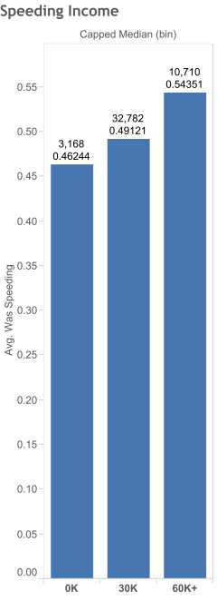

**Description of "Speeding Income"**
Average of Was Speeding for each Capped Median (bin).  The marks are labeled by sum of Number of Records and average of Was Speeding. The data is filtered on Median (bin), which keeps 0K, 60K, 120K and 180K.

**Marks**
The mark type is Bar (Automatic).
The marks are labeled by sum of Number of Records and average of Was Speeding.
Stacked marks is on.

**Shelves**
Rows:
Avg. Was Speeding
Columns:
Capped Median (bin)
Filters:
Median (bin)
Text:
Sum of Number of Records and average of Was Speeding

**Dimensions**
Capped Median (bin) has 3 members on this sheet
Members: 0K; 30K; 60K+
Median (bin) has 4 members on this sheet
Members: 0K; 120K; 180K; 60K

**Measures**
Average of Was Speeding ranges from 0.46244 to 0.54351 on this sheet.
Sum of Number of Records ranges from 3,168 to 32,782 on this sheet.
The formula is 1

####Likelihood of Speeding by Make, with Age


**Description of "Age/Brands"**

% Difference in Number of Records for each Make (makes) broken down by Speedrel.  Color shows average of AGE.  The marks are labeled by Make Name (makes) and median of AGE. The view is filtered on Speedrel, which keeps Not Speeding and Speeding.

**Marks**
The mark type is Circle.
The marks are labeled by Make Name (makes) and median of AGE.
Stacked marks is off.

**Shelves**
Rows:
Speedrel, % Difference in Number of Records
Columns:
Make
Filters:
Speedrel
Text:
Make Name (makes) and median of AGE
Color:
Average of AGE

**Dimensions**
Speedrel has 1 visible members and 1 hidden members on this sheet
Visible members: Speeding
Hidden members: Not Speeding
Make (makes) has 66 members on this sheet
Members: 1; 56; 75; 88; 97; ...
Make Name (makes) has 66 members on this sheet
Members: American Motors; Iveco/Magirus; Merkur; Norton; Not Reported; ...

**Measures**
Average of AGE ranges from 27.21 to 48.00 on this sheet.
Median of AGE ranges from 24.00 to 48.00 on this sheet.
% Difference in Number of Records ranges from -100.0% to 333.3% on this sheet.
The formula is 1
Calculates the current value as a percentage difference from the previous value.  Results are computed along Speedrel for each Make, Make Name.

####Likelihood of Speeding by Make, with Drug Use Probability
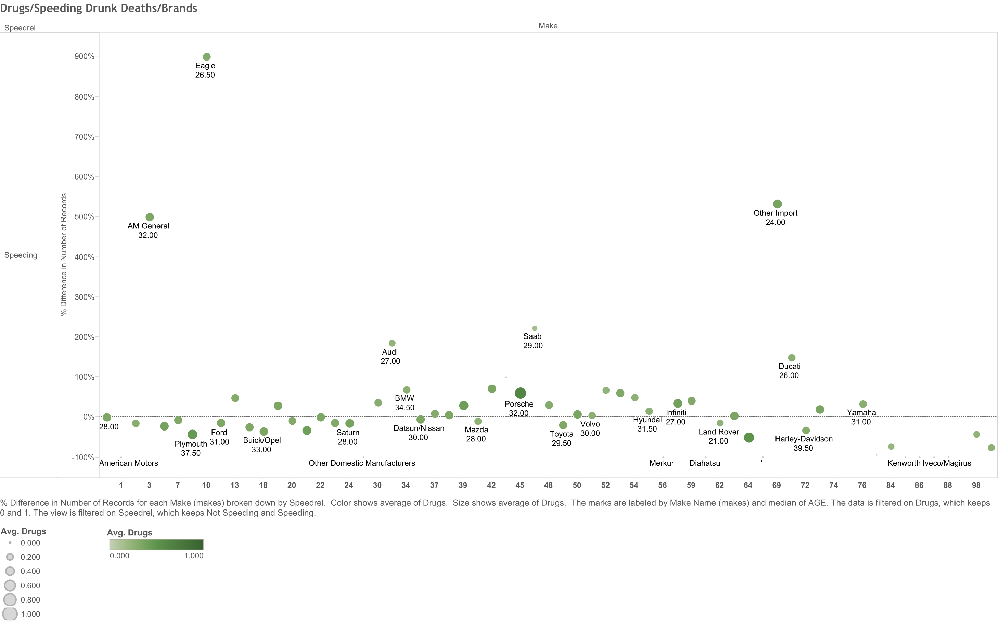

**Description of "Drugs/Speeding Drunk Deaths/Brands"**

% Difference in Number of Records for each Make (makes) broken down by Speedrel.  Color shows average of Drugs.  Size shows average of Drugs.  The marks are labeled by Make Name (makes) and median of AGE. The data is filtered on Drugs, which keeps 0 and 1. The view is filtered on Speedrel, which keeps Not Speeding and Speeding.

**Marks**
The mark type is Circle.
The marks are labeled by Make Name (makes) and median of AGE.
Stacked marks is off.

**Shelves**
Rows:
Speedrel, % Difference in Number of Records
Columns:
Make
Filters:
Speedrel, Drugs
Level of detail:
Number of Records
Text:
Make Name (makes) and median of AGE
Color:
Average of Drugs
Size:
Average of Drugs

**Dimensions**
Drugs has 2 members on this sheet
Members: 0; 1
Speedrel has 1 visible members and 1 hidden members on this sheet
Visible members: Speeding
Hidden members: Not Speeding
Make (makes) has 63 members on this sheet
Members: 1; 56; 75; 88; 97; ...
Make Name (makes) has 63 members on this sheet
Members: American Motors; Iveco/Magirus; Merkur; Norton; Not Reported; ...

**Measures**
Average of Drugs ranges from 0.000 to 1.000 on this sheet.
Median of AGE ranges from 17.00 to 48.00 on this sheet.
% Difference in Number of Records ranges from -100% to 900% on this sheet.
The formula is 1
Calculates the current value as a percentage difference from the previous value.  Results are computed along Speedrel for each Make, Make Name.
Sum of Number of Records ranges from 1 to 1,755 on this sheet.
The formula is 1


####Probability of Drug Use in Drunk Drivers by State
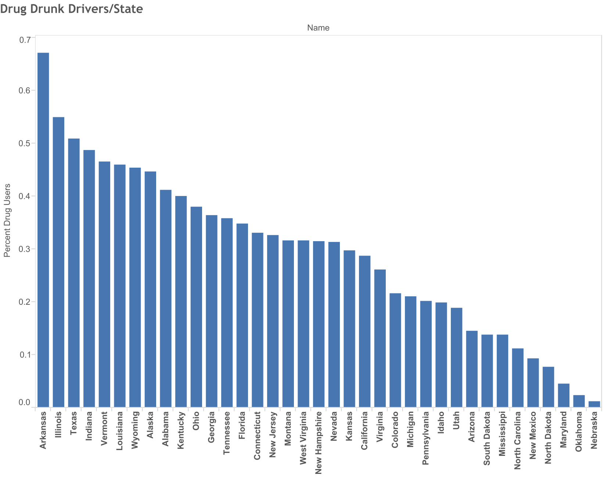

**Description of "Drug Drunk Drivers/State"**

Percent Drug Users (ACCIDENTSANDINCOME1 (CS378_BO3336)) for each Name. The data is filtered on Drugs (ACCIDENTSANDINCOME1 (CS378_BO3336)), which keeps 0 and 1. The view is filtered on sum of Number of Records (ACCIDENTSANDINCOME1 (CS378_BO3336)) and Name. The sum of Number of Records (ACCIDENTSANDINCOME1 (CS378_BO3336)) filter ranges from 99 to 2,121.

**Marks**
The mark type is Bar (Automatic).
Stacked marks is on.

**Shelves**
Rows:
Percent Drug Users
Columns:
Name
Filters:
Drugs, Number of Records, Name
Level of detail:
Number of Records

**Dimensions**
Name has 37 members on this sheet
Members:  Alabama;  Alaska;  Arizona;  Arkansas;  California; ...
Name is sorted manually.
Drugs (ACCIDENTSANDINCOME1 (CS378_BO3336)) has 2 members on this sheet
Members: 0; 1

**Measures**
Sum of Number of Records (ACCIDENTSANDINCOME1 (CS378_BO3336)) ranges from 108 to 2,121 on this sheet.
The filter associated with this field ranges from 99 to 2,121.
The formula is 1
Percent Drug Users (ACCIDENTSANDINCOME1 (CS378_BO3336)) ranges from 0.0122 to 0.6703 on this sheet.
The formula is Sum([Drugs])/count([Drugs])

####Top 8 Anomalies with Wealth Inequalities and Age
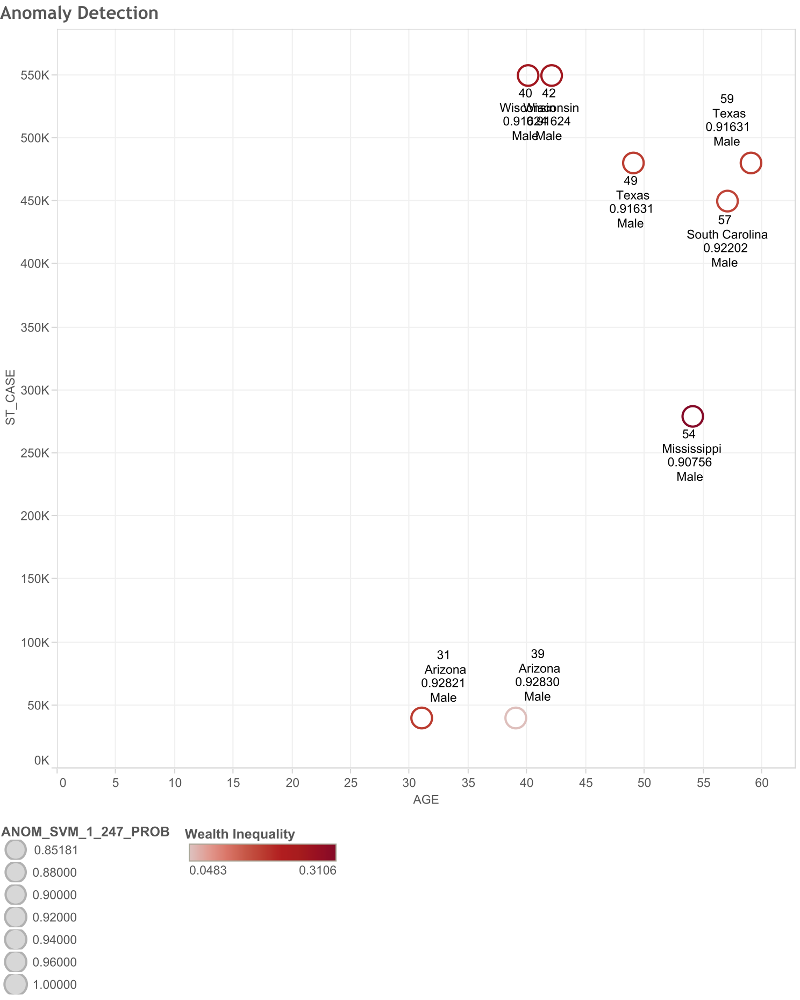

**Description of "Anomaly Detection"**

AGE vs. ST_CASE.  Color shows Wealth Inequality.  Size shows ANOM_SVM_1_247_PROB.  The marks are labeled by AGE, Name (states.csv (States1)), ANOM_SVM_1_247_PROB and SEX.  Details are shown for various dimensions. The data is filtered on ANOM_SVM_1_247_PROB and AGE. The ANOM_SVM_1_247_PROB filter includes values greater than or equal to 0.9041. The AGE filter ranges from 31 to 99.
Marks

The mark type is Shape (Automatic).
The marks are labeled by AGE, Name (states.csv (States1)), ANOM_SVM_1_247_PROB and SEX.
Stacked marks is off.

**Shelves**
Rows:
ST_CASE
Columns:
AGE
Filters:
ANOM_SVM_1_247_PROB, AGE, Measure Names
Level of detail:
Measure Names, DOA, ANOM_SVM_1_247_PROB, Deaths, Dr Drink, Has Other Record, Has Previous Accidents, Has Speeding Record, Has Suspensions, Is Drunk, MAK_MOD, Mean, Median, MOD_YEAR, MODEL, Prev Acc, Prev Dwi, Prev Oth, Prev Spd, REG_STAT, ROLINLOC, ST_CASE, TOWED, VEH_NO, Was Speeding, Make Name, Make Name, ZIP
Text:
AGE, Name (states.csv (States1)), ANOM_SVM_1_247_PROB and SEX
Color:
Wealth Inequality
Size:
ANOM_SVM_1_247_PROB

**Dimensions**
Name (states.csv (States1)) has 5 members on this sheet
Members:  Arizona;  Mississippi;  South Carolina;  Texas;  Wisconsin
Measure Names has 1 members on this sheet
Members: ST_CASE
AGE has 8 members on this sheet
Members: 31; 39; 54; 57; 59; ...
AGE ranges from 31 to 99 on this sheet.
The filter associated with this field ranges from 31 to 99.
ANOM_SVM_1_247_PROB has the value 0.9041 on this sheet.
The filter associated with this field includes values greater than or equal to 0.9041.

**Measures**
Wealth Inequality ranges from 0.0483 to 0.3106 on this sheet.
The formula is abs([Median] - [Mean])/[Mean]
ANOM_SVM_1_247_PROB ranges from 0.90756 to 0.92830 on this sheet.

###Shiny: FARS Driver Anomaly Explorer

Run

```
library(shiny)
runApp("./shiny")
```

####An image of what the interface looks like.
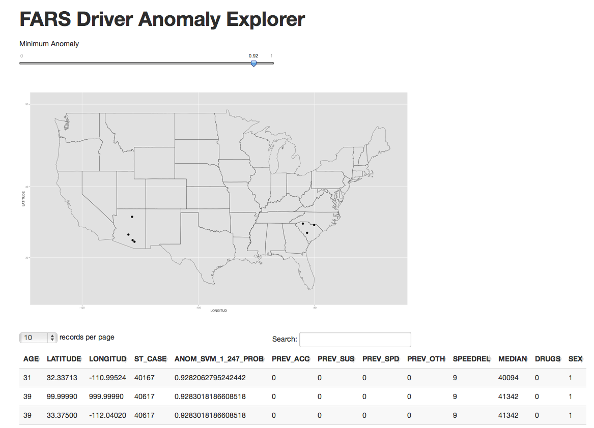


###Oracle Data Miner

###Workflow Overview
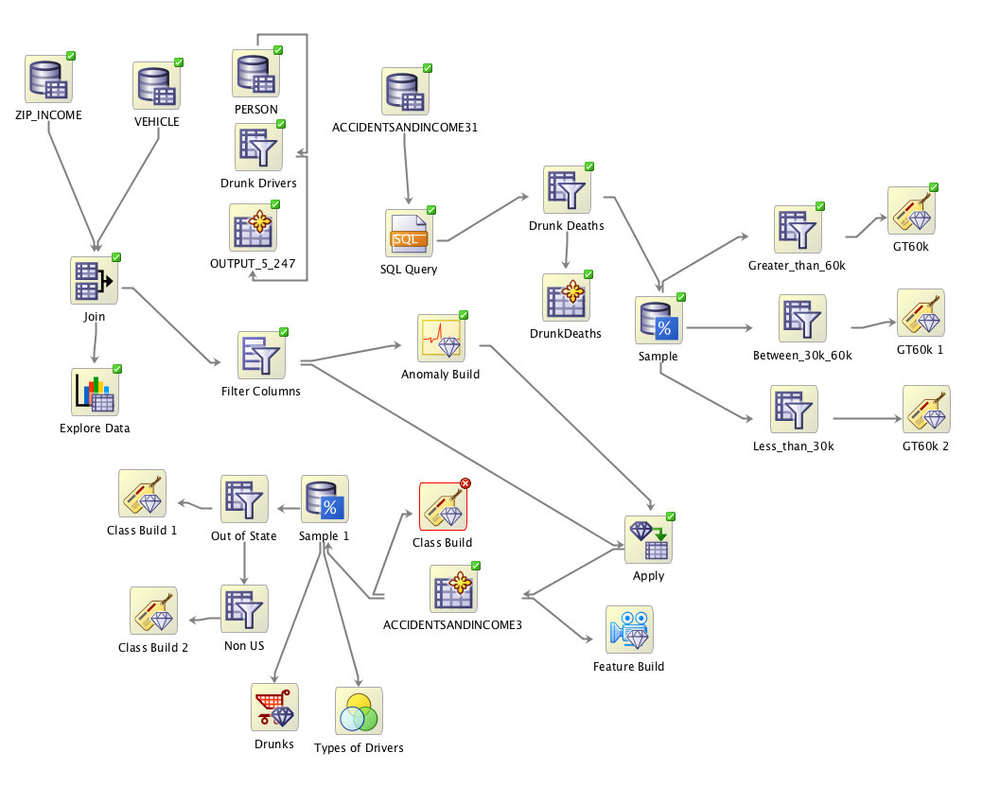

####Sampling Node for Splitting by Income Bracket
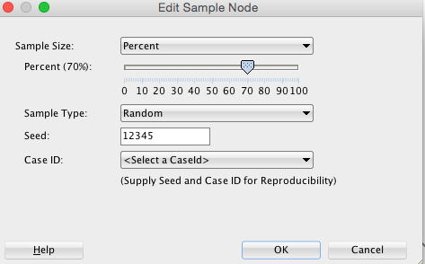

#### Row Filter for 30K Income Bracket
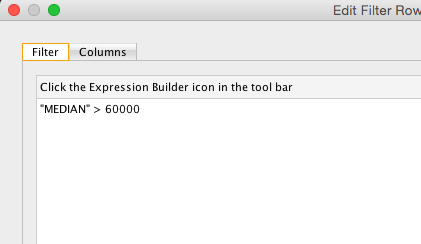

####Settings for Classification on 30K Income Bracket
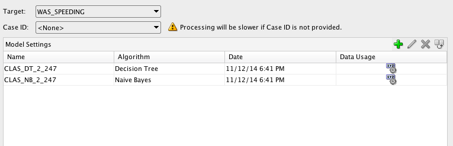

####Decision Tree for 30K Income Bracket
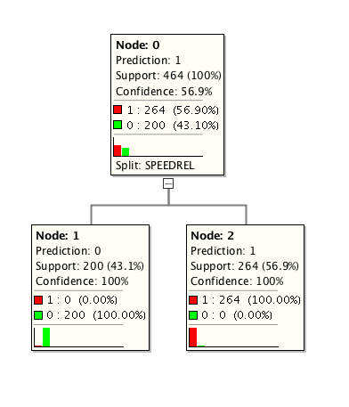

####Anomaly Build Node


####Apply Node for Anomaly Detection
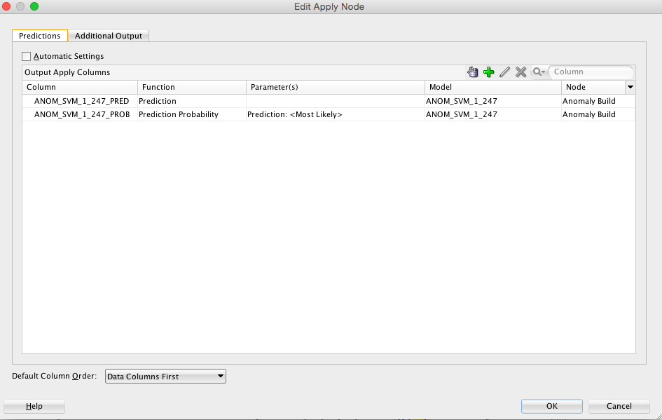

####Additional Output for Anomaly Apply Node
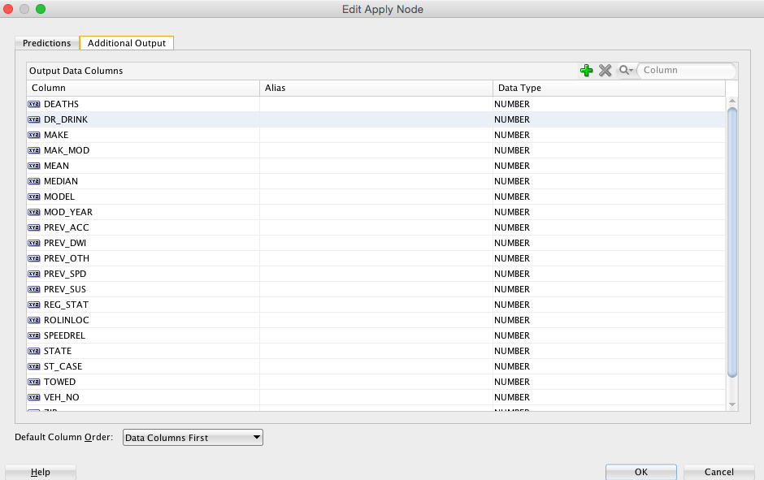

####Column Calculation to Make Binary Fields for Classification
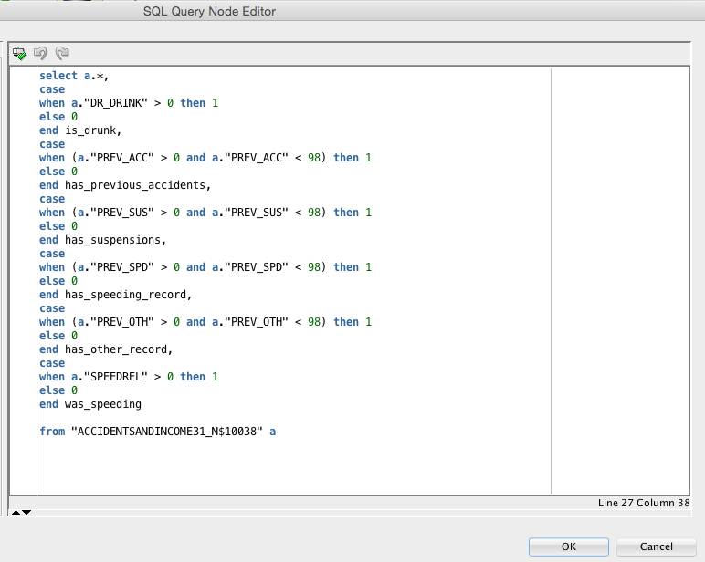

####Filter for Drivers who are Drinking
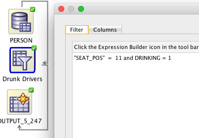

####Filter for Fatalities in Drunk Driving Accidents
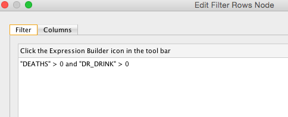

####Explore Data of joined Zip Code and Vehicles Tables
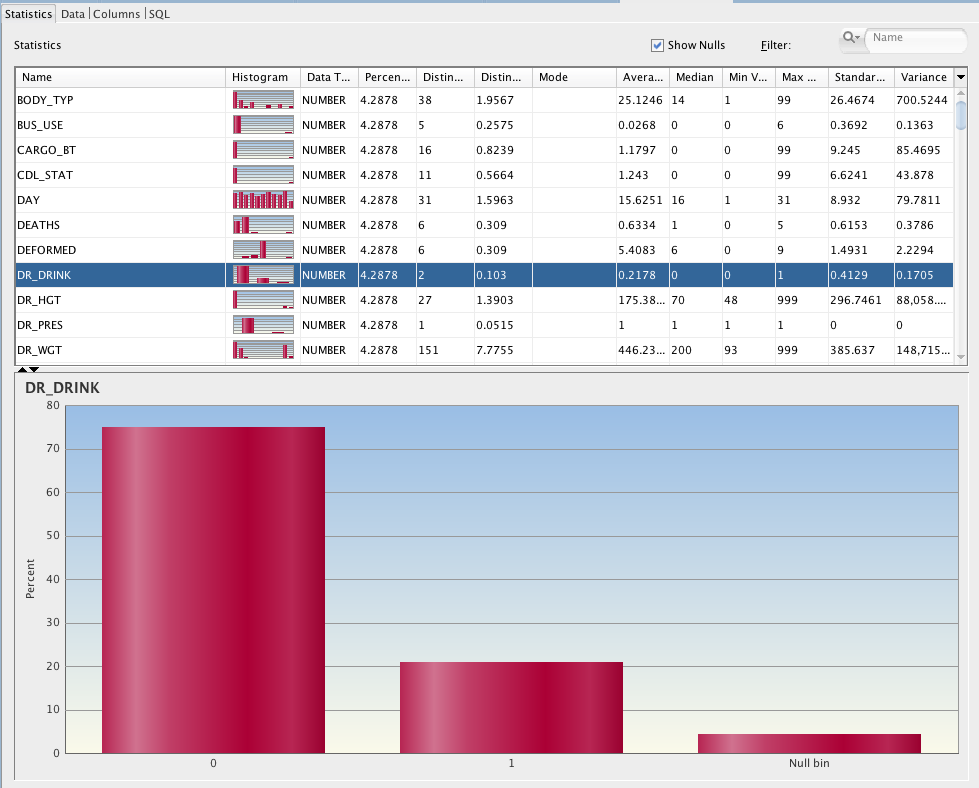

####Filters the Columnns to only 
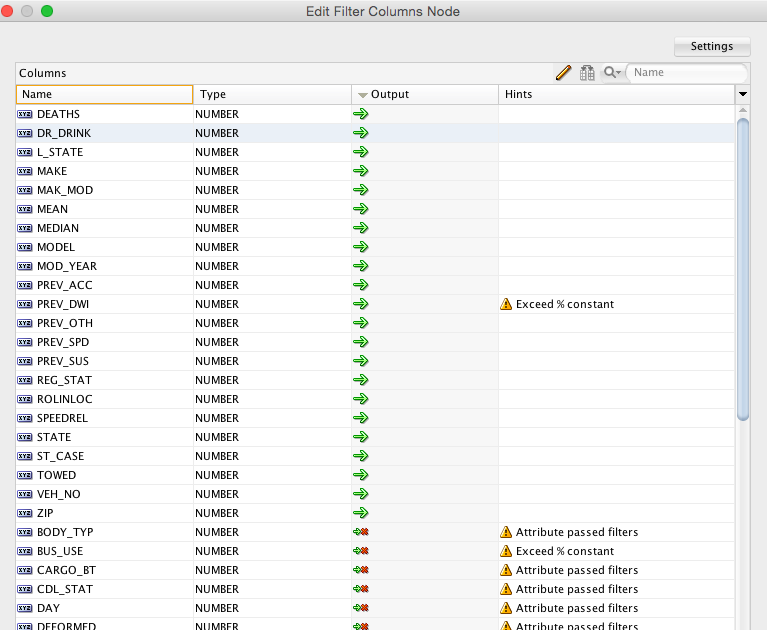


Copyright &copy; 2014 Nicholas Sundin & Brandon Olivier
